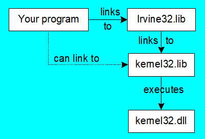

# Procedures

### Runtime Stack
* Managed by the CPU, using two registers
  * `SS` (stack segment)
  * `ESP` (stack pointer) `SP` in Real-address mode
* The stack grows downward. The area below ESP is always available (unless the stack has overflowed).
* LIFO structure.

### `PUSH` Operation
* A 32-bit push operation decrements the stack pointer by 4 and copies a value into the location pointed to by the stack pointer.

### `POP` Operation
* Copies value at stack[ESP] into a register or variable.
* Adds n to ESP, where n is either 2 or 4.
  * Value of n depends on the attribute of the operand receiving the data

```asm
PUSH syntax:
    PUSH r/m16		
    PUSH r/m32
    PUSH imm32
POP syntax:
    POP r/m16		
    POP r/m32
```
### Nested Loop
*  When creating a nested loop, push the outer loop counter before entering the inner loop:
```asm
mov ecx,100     ; set outer loop count
L1:             ; begin the outer loop
    push ecx	; save outer loop count
    
    mov ecx,20	; set inner loop count
L2:             ; begin the inner loop
    .
    .
    .
    loop L2	; repeat the inner loop
    
    pop ecx	; restore outer loop count
    loop L1	; repeat the outer loop
```

### Reversing a String
* Use a loop with indexed addressing
* Push each character on the stack
* Start at the beginning of the string, pop the stack in reverse order, insert each character back into the string
* Only word (16-bit) or doubleword (32-bit) values can be pushed on the stack.
  * Move each value to `ax` or `eax`
```asm

```

---
## `PUSHFD` and `POPFD`
* push and pop the EFLAGS register.

## `PUSHAD` and `POPAD`
* Order: EAX, ECX, EDX, EBX, ESP, EBP, ESI, EDI
* `PUSHAD` pushes the 32-bit general-purpose registers on the stack in order.
* `POPAD` pops the same registers off the stack in reverse order.


## `PUSHA` and `POPA`
* Order: AX, CX, DX, BX, SP, BP, SI, DI
* `PUSHA` pushes the 16-bit general-purpose registers on the stack in order.
* `POPA` pops the same registers off the stack in reverse order.
---
### Exercise 1
Write a program that does the following:
* Assigns integer values to EAX, EBX, ECX, EDX, ESI, and EDI
* Uses `PUSHAD` to push the general-purpose registers on the stack
* Using a loop, your program should pop each integer from the stack and display it on the screen

Answer
```asm
INCLUDE Irvine32.inc

.code
main PROC

    mov eax, 10
    mov ebx, 20
    mov ecx, 30
    mov edx, 40
    mov esi, 1000
    mov edi, 2000

    pushad

    mov ecx, 8
L1:
    pop eax
    mov edx, eax
    call WriteDec
	call Crlf
    loop L1

main ENDP
END main
```
---

# Creating Procedures
* Large problems can be divided into smaller tasks to make them more manageable
* A procedure is the ASM equivalent of a Java or C++ function
* Following is an assembly language procedure named `sample`:
```asm
sample PROC
    .
    .
    ret
sample ENDP
```
* Suggested documentation for each procedure:
  * A description of all tasks accomplished by the procedure.
  * Receives: A list of input parameters; state their usage and requirements.
  * Returns: A description of values returned by the procedure.
  * Requires: Optional list of requirements called preconditions that must be satisfied before the procedure is called.
* If a procedure is called without its preconditions satisfied, it will  probably not produce the expected output.
* Example: SumOf porcesure
```asm
;---------------------------------------------------------
SumOf PROC
; Calculates and returns the sum of three 32-bit integers.
; Receives: EAX, EBX, ECX, the three integers. May be signed or unsigned.
; Returns: EAX = sum, and the status flags (Carry, Overflow, etc.) are changed.
; Requires: nothing
;---------------------------------------------------------
    add eax,ebx
    add eax,ecx
    ret
SumOf ENDP
```
---
## `CALL` and `RET` Instructions
* The `CALL` instruction calls a procedure
  * pushes offset of next instruction on the stack
  * copies the address of the called procedure into `EIP`
* The `RET` instruction returns from a procedure
  * pops top of stack into `EIP`
### Example
* 0000025 is the offset of the instruction immediately following the CALL instruction
* 00000040 is the offset of the first instruction inside MySub
* The `CALL` instruction pushes 00000025 onto the stack, and loads 00000040 into EIP
* The `RET` instruction pops 00000025 from the stack into EIP

```asm
main PROC
    00000020 call MySub
    00000025 mov eax, ebx
    .
    .
main ENDP

MySub PROC
    00000040 mov eax, edx   
    .
    .
    ret
MySub ENDP

```
---
## Local and Global Labels
A local label is visible only to statements inside the same procedure. A global label is visible everywhere.
* Use a colon `:` for local label.
* Use double colon `::` for global label.
---
## Procedure Parameters 
* Parameters help to make procedures flexible because parameter values can change at runtime
* Parameters help to make procedures be usable in many different programs
* The `ArraySum` procedure calculates the sum of an array.
  * Parameters are specified on `Receives`
```asm
ArraySum PROC
; Receives: ESI points to an array of doublewords, 
;           ECX = number of array elements.
; Returns:  EAX = sum
;-----------------------------------------------------
    mov eax, 0	    ; set the sum to zero
    
L1: add eax, [esi]  ; add each integer to sum
    add esi, 4      ; point to next integer
    loop L1         ; repeat for array size

    ret
ArraySum ENDP

```
---
## `USES` Operator
* Lists the registers that will be preserved 
  * It generates push and pop codes for the registers. 
  * Saves and restore the values that are in the registers.

```asm
ArraySum PROC USES esi ecx
    .
    .
    .
ArraySum ENDP

MASM generates the pushes and pops:
ArraySum PROC
    push esi
    push ecx
    .
    .
    .
    pop ecx
    pop esi
    ret
ArraySum ENDP

```
* The sum of the three registers is stored in EAX, 
  * If you put `eax` uses list, the `POP` instruction will replace it with the starting value of `eax`
  
---
# Linking to an External Library
* A file containing procedures that have been compiled into machine code 
  * constructed from one or more OBJ files
* To build a library, ...
  * start with one or more ASM source files
  * assemble each into an OBJ file
  * create an empty library file (extension .LIB)
  * add the OBJ file(s) to the library file, using the Microsoft LIB utility

### How The Linker Works
* Your programs link to Irvine32.lib using the linker command inside a batch file named make32.bat.
* Notice the two LIB files: Irvine32.lib, and kernel32.lib 
  * the latter is part of the Microsoft Win32 Software Development Kit (SDK)

---
# Irvine32 Library 
* The INCLUDE directive copies in the procedure prototypes (declarations).
* Call each procedure using the CALL instruction. Some procedures require input arguments.
* The following example displays "1234" on the console:
```asm
INCLUDE Irvine32.inc
.code
    mov  eax,1234h  ; input argument
    call WriteHex   ; show hex number
    call Crlf       ; end of line
```

### Irvine32
```asm
CloseFile:           Closes an open disk file
Clrscr:              Clears console, locates cursor at upper left corner
CreateOutputFile:    Creates new disk file for writing in output mode
Crlf:                Writes end of line sequence to standard output, (Carriage Return Line Feed)
Delay:               Pauses program execution for n millisecond interval
DumpMem:             Writes block of memory to standard output in hex
DumpRegs:            Displays general-purpose registers and flags (hex)
GetCommandtail:      Copies command-line args into array of bytes
GetDateTime:         Gets the current date and time from the system
GetMaxXY:            Gets number of cols, rows in console window buffer
GetMseconds:         Returns milliseconds elapsed since midnight
GetTextColor:        Returns active foreground and background text colors in the console window
Gotoxy:              Locates cursor at row and column on the console
IsDigit:             Sets Zero flag if AL contains ASCII code for decimal digit (0–9) 
MsgBox:              Display popup message boxes 
MsgBoxAsk:           Display popup message boxes 
OpenInputFile:       Opens existing file for input 
ParseDecimal32:      Converts unsigned integer string to binary
ParseInteger32:      Converts signed integer string to binary 
Random32:            Generates 32-bit pseudorandom integer in the range 0 to FFFFFFFFh
Randomize:           Seeds the random number generator
RandomRange:         Generates a pseudorandom integer within a specified range
ReadChar:            Reads a single character from standard input
Str_ucase:           Converts a string to uppercase letters.
WaitMsg:             Displays message, waits for Enter key to be pressed
WriteBin:            Writes unsigned 32-bit integer in ASCII binary format.
WriteBinB:           Writes binary integer in byte, word, or doubleword format 
WriteChar:           Writes a single character to standard output
WriteDec:            Writes unsigned 32-bit integer in decimal format
WriteHex:            Writes an unsigned 32-bit integer in hexadecimal format
WriteHexB:           Writes byte, word, or doubleword in hexadecimal format
WriteInt:            Writes signed 32-bit integer in decimal format
WriteStackFrame:     Writes the current procedure’s stack frame to the console.
WriteStackFrameName: Writes the current procedure’s name and stack frame to the console.
WriteString:         Writes null-terminated string to console window
WriteToFile:         Writes buffer to output file
WriteWindowsMsg:     Displays most recent error message generated by MS-Windows
```
---

## Examples

* Clear the screen, delay the program for 500 milliseconds, and dump the registers and flags.
```asm
.code
    call Clrscr
    mov  eax, 500
    call Delay
    call DumpRegs
```

* Display a null-terminated string and move the cursor to the beginning of the next screen line.
```asm
.data
    str1 BYTE "Assembly language is easy!",0

.code
    mov  edx, OFFSET str1
    call WriteString
    call Crlf
```

* Display a null-terminated string and move the cursor to the beginning of the next screen line (use embedded CR/LF)
```asm
.data
    str1 BYTE "Assembly language is easy!",0Dh,0Ah,0

.code
    mov  edx, OFFSET str1
    call WriteString
```
* Display an unsigned integer in binary, decimal, and hexadecimal, each on a separate line.
```asm
.code
    mov  eax, 35
    call WriteBin	; display binary
    call Crlf
    call WriteDec	; display decimal
    call Crlf
    call WriteHex	; display hexadecimal
    call Crlf
```

* Input a string from the user. EDX points to the string and ECX specifies the maximum number of characters the user is permitted to enter.
  * A null byte is automatically appended to the string
```asm
.data
    fileName BYTE 80 DUP(0)

.code
    mov  edx,OFFSET fileName
    mov  ecx,SIZEOF fileName – 1
    call ReadString

```

* Generate and display ten pseudorandom signed integers in the range 0 – 99. Pass each integer to WriteInt in EAX and display it on a separate line.

```asm
.code
    mov ecx,10          ; loop counter

L1: mov  eax,100        ; ceiling value
    call RandomRange    ; generate random int
    call WriteInt       ; display signed int
    call Crlf           ; goto next display line
    loop L1             ; repeat loop
```

* Display a null-terminated string with yellow characters on a blue background.
  * The background color is multiplied by 16 before being added to the foreground color.
```asm
.data
    str1 BYTE "Color output is easy!",0

.code
    mov  eax,yellow + (blue * 16)
    call SetTextColor
    mov  edx,OFFSET str1
    call WriteString
    call Crlf
```

---

## Irvine64 Library
```asm
Crlf:           Writes an end-of-line sequence to the console.
Random64:       Generates a 64-bit pseudorandom integer. 
Randomize:      Seeds the random number generator with a unique value.
ReadInt64:      Reads a 64-bit signed integer from the keyboard.
ReadString:     Reads a string from the keyboard. 
Str_compare:    Compares two strings in the same way as the CMP instruction.
Str_copy:       Copies a source string to a target location. 
Str_length:     Returns the length of a null-terminated string in RAX.
WriteInt64:     Displays the contents in the RAX register as a 64-bit signed decimal integer.
WriteHex64:     Displays the contents of the RAX register as a 64-bit hexadecimal integer.
WriteHexB:      Displays the contents of the RAX register as an 8-bit hexadecimal integer .
WriteString:    Displays a null-terminated ASCII string. 
```